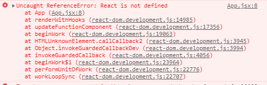

# day-19
## ant-design-mobile 案例项目
## 试试使用vite实现这个项目

## 项目依赖
* React 核心库：react、react-dom、react-router-dom
* 脚手架：create-react-app
* 数据秦桧去： axios
* 其他组件库react-Virtualized（长列表优化，比如说地名）、formik+yup（表单校验）、react-spring（react动画）
* 百度API

## 项目搭建

### 本地接口部署
1. 创建并导入数据：数据库库名称 hkzf(固定名称)
2. 启动接口：在API目录中执行 npm start
3. 测试接口：接口地址 http://localhost:8080
### Swagger
> 用于复杂的接口文档数据请求文档的自动处理
### 初始化项目
1. 初始化项目npx create-react-app hkzf-mobile
  npm install --save react-router-dom
2. 启动项目 项目更目录执行命令：yarn start
src/ 文件代码目录
  assets 项目静态资源
  component 公共组件
  pages/页面
  utils 工具（公共方法）
  app.js 根目录
  index.css 全局样式
  index.js 项目入口文件

### 组件库 antd-mobile
官网：https://mobile.ant.design/index-cn
1. 打开 antd-mobile 的文档
2. 安装: npm install antd-mobile --save
3. 在app.js 根组件中导入要使用的组件
4. 渲染组件
5. 在 index.js 中导入组件库样式

### 项目基础路由配置
1. 安装npm install react-router-dom  react-router-config
2. 导入路由组件Router、Router、link
3. 在pages文件夹中创建Home/index.js和CityList/index.js两个组件
4. 使用Route组件配置首页和城市选择页面

### 修改页面样式
1. 修改页面标题
2. 在入口html文件中将以下代码复制内部
```html
<!DOCTYPE html>
<html>
<head>
  <!-- set `maximum-scale` for some compatibility issues -->
  <meta name="viewport" content="width=device-width, initial-scale=1, maximum-scale=1, minimum-scale=1, user-scalable=no" />


  <!-- 解决原生手机端点击事件延迟300毫秒的bug问题 -->
  <script src="https://as.alipayobjects.com/g/component/fastclick/1.0.6/fastclick.js"></script>
  <script>
    if ('addEventListener' in document) {
      document.addEventListener('DOMContentLoaded', function() {
        FastClick.attach(document.body);
      }, false);
    }
    if(!window.Promise) {
      document.writeln('<script src="https://as.alipayobjects.com/g/component/es6-promise/3.2.2/es6-promise.min.js"'+'>'+'<'+'/'+'script>');
    }
  </script>


</head>
<body></body>
</html>
```

3. 在组件中使用实例 


### TabBar
> 由于tabBar一般不会改变，且一般由4-5个组成，所以就定义了数据方便渲染
```jsx
class App extends React.Component {
  // 获取当前页面路由地址
  state = {
    selectedTab: this.props.history.location.pathname,
    tabbarList: [
      { title: "首页", icon: "icon-ind", path: "/home" },
      { title: "找房", icon: "icon-findHouse", path: "/findhouse" },
      { title: "资讯", icon: "icon-infom", path: "/news" },
      { title: "我的", icon: "icon-my", path: "my" }
    ]
  }
  
  render() {
    return (
      <div className="App">
        {renderRoutes(this.props.route.children)}
        <div className="tabbar">
          <TabBar
          >
            {this.state.tabbarList.map(item => (
              <TabBar.Item
                // 标题
                title={item.title}
                // 标识符
                key={item.title}
                // 图标
                icon={<i className={`iconfont ${item.icon}`}></i>}
                // 选中后的展示图片
                selectedIcon={<i className={`iconfont ${item.icon}`}></i>}
                // 是否选中
                selected={this.state.selectedTab === item.path}
                // 点击时触发的事件
                onPress={() => {
                  this.props.history.push(item.path)
                  this.setState({
                    selectedTab: item.path
                  })
                }}
              >
              </TabBar.Item>
            ))}
          </TabBar>
        </div>
      </div>
    );
  }
}

export default App;
```
### 轮播图
npm install axios;
> 19-day-19-2021-06-21\hkzf-mobile\src\pages\Home\index.jsx
```jsx
import { Carousel, Flex } from "antd-mobile";
import React from "react";
// 导入axios
import axios from "axios";
import Nav1 from "../../assets/images/nav-1.png";
import Nav2 from "../../assets/images/nav-2.png";
import Nav3 from "../../assets/images/nav-3.png";
import Nav4 from "../../assets/images/nav-4.png";
// 外部定义数据，当数据为固定时就可以在外部定义数据
const NavList = [
  { title: "整租", path: "/findhouse", imgSrc: Nav1 },
  { title: "合租", path: "/findhouse", imgSrc: Nav2 },
  { title: "地图找房", path: "/findhouse", imgSrc: Nav3 },
  { title: "去出租", path: "/findhouse", imgSrc: Nav4 }
]
class Home extends React.Component {
  state = {
    imgHeight: "176",
    swiperData: [],
    // 网络请求是否已经存在
    isFinite: false
  }
  // 异步方法获取图片数据
  componentDidMount() {
    let _this = this;
    axios.get("http://localhost:8080/home/swiper")
      .then(function (res) {
        if (res.data.status === 200) {

          _this.setState({
            swiperData: res.data.body,
            isFinite: true
          }, () => {
            console.log(_this.state.swiperData)
          })
        }
      })
  }
  // 设置轮播图模板
  getSwiper() {
    return this.state.swiperData.map(item => (
      <a
        key={item.id}
        href="http://www.czxy.com"
        style={{ display: 'inline-block', width: '100%', height: this.state.imgHeight }}
      >
         {
            window.dispatchEvent(new Event('resize'));
            this.setState({ imgHeight: 'auto' });
          }}
        />
      </a>
    ))
  }


  render() {
    return (
      <div className="Home">
        {
          // 判断数据是否已经获取成功，如果在数据没有画出成功就渲染轮播图组件的话就会道中数据页面数据不会改变
          this.state.isFinite ?
            <Carousel autoplay infinite>{this.getSwiper()}</Carousel> : ("")
        }
        <Flex className="nav">
          {
            NavList.map((item, index) => (
              <Flex.Item key={index} onClick={() => { this.props.history.push(item.path); }}>
                
                <p>{item.title}</p>
              </Flex.Item>
            ))
          }
        </Flex>
      </div>
    )
  }
}

export default Home;
```
### 使用vite创建项目出现的问题
#### 创建函数组件报错
>问题原因？？？？未知
>
>


>解决方法： 这是因为没有导入react包导致的,导入react即可使用
```js
import React from "react";
```

